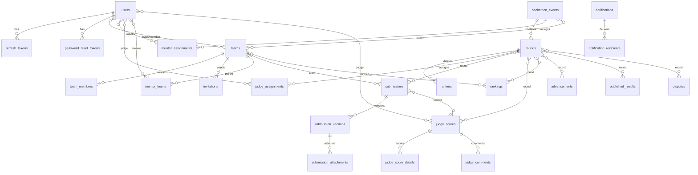

# SEAL Hackathon — Entity-Relationship Diagram

## Relationship Diagram (Mermaid)

---

## Table Definitions

### Legend

- **PK** = Primary Key
- **FK** = Foreign Key (JPA `@ManyToOne` / `@JoinColumn` — same module)
- **REF** = Cross-module reference (UUID column, no JPA FK — enforced at service layer)
- **UQ** = Unique constraint
- **IDX** = Recommended index
- **NN** = NOT NULL
- **DEF** = Default value
- Audit columns (`id`, `created_at`, `updated_at`, `created_by`, `updated_by`) inherited from `BaseEntity` are listed once and apply to every table except `audit_logs`

### BaseEntity Columns (inherited by all tables except audit_logs)

| Column | Type | Constraints | Notes |
|---|---|---|---|
| `id` | `UUID` | PK, NN | `@GeneratedValue(strategy = UUID)` |
| `created_at` | `TIMESTAMP` | NN | `@CreatedDate`, immutable |
| `updated_at` | `TIMESTAMP` | | `@LastModifiedDate` |
| `created_by` | `VARCHAR(255)` | | `@CreatedBy`, immutable |
| `updated_by` | `VARCHAR(255)` | | `@LastModifiedBy` |

---

### 1. `users` (User Module)

**Aggregate Root** | BR-01, BR-02, BR-03, BR-04, BR-05, BR-06

| Column | Type | Constraints | BR | Notes |
|---|---|---|---|---|
| `id` | `UUID` | PK | | BaseEntity |
| `email` | `VARCHAR(255)` | NN, UQ | BR-04 | Unique across all statuses |
| `password_hash` | `VARCHAR(255)` | NN | BR-03 | Input validated ≥ 6 chars |
| `full_name` | `VARCHAR(255)` | NN | | |
| `phone` | `VARCHAR(20)` | | | |
| `student_id` | `VARCHAR(20)` | | BR-03 | FPT: regex `SE[0-9]{6}` |
| `university_name` | `VARCHAR(255)` | | BR-03 | Required for EXTERNAL_STUDENT |
| `user_type` | `VARCHAR(30)` | NN | BR-01, BR-02 | Enum: `UserType` |
| `status` | `VARCHAR(20)` | NN, DEF `PENDING` | BR-01, BR-06 | Enum: `AccountStatus` |
| `failed_login_attempts` | `INT` | NN, DEF `0` | BR-06 | Reset on success |
| `locked_until` | `TIMESTAMP` | | BR-06 | null = not locked |
| `created_at` | `TIMESTAMP` | NN | | |
| `updated_at` | `TIMESTAMP` | | | |
| `created_by` | `VARCHAR(255)` | | | |
| `updated_by` | `VARCHAR(255)` | | | |

**Unique Constraints:**
- `UQ_users_email` → `(email)`

**Indexes:**
- `IDX_users_email` → `(email)` — login lookup
- `IDX_users_status` → `(status)` — admin approval queue
- `IDX_users_user_type` → `(user_type)` — role-based queries

---

### 2. `refresh_tokens` (Auth Module)

BR-05, BR-07

| Column | Type | Constraints | BR | Notes |
|---|---|---|---|---|
| `id` | `UUID` | PK | | |
| `token` | `VARCHAR(255)` | NN, UQ | BR-05 | Opaque token string |
| `user_id` | `UUID` | NN, REF→`users.id` | BR-05 | Cross-module ref |
| `expires_at` | `TIMESTAMP` | NN | BR-05 | TTL = 7 days |
| `revoked` | `BOOLEAN` | NN, DEF `false` | BR-07 | Set true on logout/reset |
| `created_at` | `TIMESTAMP` | NN | | |
| `updated_at` | `TIMESTAMP` | | | |
| `created_by` | `VARCHAR(255)` | | | |
| `updated_by` | `VARCHAR(255)` | | | |

**Unique Constraints:**
- `UQ_refresh_tokens_token` → `(token)`

**Indexes:**
- `IDX_refresh_tokens_user_id` → `(user_id)` — revoke all on password reset
- `IDX_refresh_tokens_token` → `(token)` — token lookup

---

### 3. `password_reset_tokens` (Auth Module)

BR-07

| Column | Type | Constraints | BR | Notes |
|---|---|---|---|---|
| `id` | `UUID` | PK | | |
| `token` | `VARCHAR(255)` | NN, UQ | BR-07 | One-time use |
| `user_id` | `UUID` | NN, REF→`users.id` | BR-07 | Cross-module ref |
| `expires_at` | `TIMESTAMP` | NN | BR-07 | TTL = 15 minutes |
| `used` | `BOOLEAN` | NN, DEF `false` | BR-07 | Invalidated after use |
| `created_at` | `TIMESTAMP` | NN | | |
| `updated_at` | `TIMESTAMP` | | | |
| `created_by` | `VARCHAR(255)` | | | |
| `updated_by` | `VARCHAR(255)` | | | |

**Unique Constraints:**
- `UQ_password_reset_tokens_token` → `(token)`

**Indexes:**
- `IDX_password_reset_tokens_token` → `(token)` — reset-link lookup
- `IDX_password_reset_tokens_user_id` → `(user_id)`

---

### 4. `hackathon_events` (Event Module)

**Aggregate Root** | BR-08, BR-10

| Column | Type | Constraints | BR | Notes |
|---|---|---|---|---|
| `id` | `UUID` | PK | | |
| `name` | `VARCHAR(255)` | NN, UQ | BR-10 | Unique event name |
| `season` | `VARCHAR(50)` | NN | BR-08 | e.g. "Summer" |
| `year` | `INT` | NN | BR-08 | e.g. 2026 |
| `start_date` | `DATE` | NN | BR-09 | Round dates must be within |
| `end_date` | `DATE` | NN | BR-09 | |
| `registration_deadline` | `DATE` | NN | BR-15 | Team registration cutoff |
| `status` | `VARCHAR(20)` | NN, DEF `DRAFT` | BR-08 | Enum: `EventStatus` |
| `created_at` | `TIMESTAMP` | NN | | |
| `updated_at` | `TIMESTAMP` | | | |
| `created_by` | `VARCHAR(255)` | | | |
| `updated_by` | `VARCHAR(255)` | | | |

**Unique Constraints:**
- `UQ_hackathon_events_name` → `(name)`

**Indexes:**
- `IDX_hackathon_events_status` → `(status)` — active event listing

---

### 5. `rounds` (Event Module)

BR-09, BR-11, BR-12, BR-32, BR-40

| Column | Type | Constraints | BR | Notes |
|---|---|---|---|---|
| `id` | `UUID` | PK | | |
| `event_id` | `UUID` | NN, FK→`hackathon_events.id` | BR-09 | |
| `round_number` | `INT` | NN, ≥ 1 | | |
| `name` | `VARCHAR(255)` | NN | | |
| `start_date` | `TIMESTAMP` | NN | BR-09 | Must be within event dates |
| `end_date` | `TIMESTAMP` | NN | BR-09 | No overlap with sibling rounds |
| `submission_deadline` | `TIMESTAMP` | NN | BR-32 | No submissions after this |
| `scoring_deadline` | `TIMESTAMP` | NN | BR-40 | Scores locked after this |
| `advancement_cutoff` | `INT` | NN, ≥ 1 | BR-12 | Top N teams advance |
| `created_at` | `TIMESTAMP` | NN | | |
| `updated_at` | `TIMESTAMP` | | | |
| `created_by` | `VARCHAR(255)` | | | |
| `updated_by` | `VARCHAR(255)` | | | |

**Foreign Keys:**
- `FK_rounds_event_id` → `hackathon_events(id)`

**Unique Constraints:**
- `UQ_rounds_event_round` → `(event_id, round_number)`

**Indexes:**
- `IDX_rounds_event_id` → `(event_id)` — list rounds by event

---

### 6. `criteria` (Event Module)

BR-11, BR-44

| Column | Type | Constraints | BR | Notes |
|---|---|---|---|---|
| `id` | `UUID` | PK | | |
| `round_id` | `UUID` | NN, FK→`rounds.id` | BR-11 | |
| `name` | `VARCHAR(255)` | NN | BR-44 | e.g. Technical, Innovation |
| `description` | `VARCHAR(1000)` | | | |
| `weight` | `INT` | NN, [1–100] | BR-11 | All weights per round sum to 100 |
| `sort_order` | `INT` | NN, DEF `0` | | Display order |
| `created_at` | `TIMESTAMP` | NN | | |
| `updated_at` | `TIMESTAMP` | | | |
| `created_by` | `VARCHAR(255)` | | | |
| `updated_by` | `VARCHAR(255)` | | | |

**Foreign Keys:**
- `FK_criteria_round_id` → `rounds(id)`

**Indexes:**
- `IDX_criteria_round_id` → `(round_id)` — list criteria by round

---

### 7. `judge_assignments` (Event Module)

BR-13

| Column | Type | Constraints | BR | Notes |
|---|---|---|---|---|
| `id` | `UUID` | PK | | |
| `round_id` | `UUID` | NN, FK→`rounds.id` | BR-13 | Per round, not event |
| `judge_user_id` | `UUID` | NN, REF→`users.id` | BR-13 | Cross-module ref |
| `assigned_at` | `TIMESTAMP` | NN | | |
| `created_at` | `TIMESTAMP` | NN | | |
| `updated_at` | `TIMESTAMP` | | | |
| `created_by` | `VARCHAR(255)` | | | |
| `updated_by` | `VARCHAR(255)` | | | |

**Foreign Keys:**
- `FK_judge_assignments_round_id` → `rounds(id)`

**Unique Constraints:**
- `UQ_judge_assignments_round_judge` → `(round_id, judge_user_id)`

**Indexes:**
- `IDX_judge_assignments_round_id` → `(round_id)`
- `IDX_judge_assignments_judge_user_id` → `(judge_user_id)` — "my assignments" query

---

### 8. `mentor_assignments` (Event Module)

BR-14

| Column | Type | Constraints | BR | Notes |
|---|---|---|---|---|
| `id` | `UUID` | PK | | |
| `event_id` | `UUID` | NN, FK→`hackathon_events.id` | BR-14 | Per event |
| `mentor_user_id` | `UUID` | NN, REF→`users.id` | BR-14 | Cross-module ref |
| `assigned_at` | `TIMESTAMP` | NN | | |
| `created_at` | `TIMESTAMP` | NN | | |
| `updated_at` | `TIMESTAMP` | | | |
| `created_by` | `VARCHAR(255)` | | | |
| `updated_by` | `VARCHAR(255)` | | | |

**Foreign Keys:**
- `FK_mentor_assignments_event_id` → `hackathon_events(id)`

**Unique Constraints:**
- `UQ_mentor_assignments_event_mentor` → `(event_id, mentor_user_id)`

**Indexes:**
- `IDX_mentor_assignments_event_id` → `(event_id)`
- `IDX_mentor_assignments_mentor_user_id` → `(mentor_user_id)`

---

### 9. `teams` (Team Module)

**Aggregate Root** | BR-15, BR-18, BR-19, BR-20, BR-22

| Column | Type | Constraints | BR | Notes |
|---|---|---|---|---|
| `id` | `UUID` | PK | | |
| `event_id` | `UUID` | NN, REF→`hackathon_events.id` | BR-18, BR-19 | Cross-module ref |
| `name` | `VARCHAR(255)` | NN | BR-19 | Unique per event |
| `leader_id` | `UUID` | NN, REF→`users.id` | BR-20 | Cross-module ref |
| `status` | `VARCHAR(20)` | NN, DEF `FORMING` | BR-22 | Enum: `TeamStatus` |
| `created_at` | `TIMESTAMP` | NN | | |
| `updated_at` | `TIMESTAMP` | | | |
| `created_by` | `VARCHAR(255)` | | | |
| `updated_by` | `VARCHAR(255)` | | | |

**Unique Constraints:**
- `UQ_teams_event_name` → `(event_id, name)` — BR-19

**Indexes:**
- `IDX_teams_event_id` → `(event_id)` — list teams by event
- `IDX_teams_leader_id` → `(leader_id)` — find team by leader
- `IDX_teams_status` → `(status)` — filter by confirmation status

---

### 10. `team_members` (Team Module)

BR-15, BR-18, BR-20

| Column | Type | Constraints | BR | Notes |
|---|---|---|---|---|
| `id` | `UUID` | PK | | |
| `team_id` | `UUID` | NN, FK→`teams.id` | BR-15 | |
| `user_id` | `UUID` | NN, REF→`users.id` | BR-18 | Cross-module ref |
| `role` | `VARCHAR(20)` | NN | BR-20 | Enum: `TeamMemberRole` |
| `joined_at` | `TIMESTAMP` | NN | | |
| `created_at` | `TIMESTAMP` | NN | | |
| `updated_at` | `TIMESTAMP` | | | |
| `created_by` | `VARCHAR(255)` | | | |
| `updated_by` | `VARCHAR(255)` | | | |

**Foreign Keys:**
- `FK_team_members_team_id` → `teams(id)`

**Unique Constraints:**
- `UQ_team_members_team_user` → `(team_id, user_id)` — no duplicate membership

**Indexes:**
- `IDX_team_members_team_id` → `(team_id)` — list members
- `IDX_team_members_user_id` → `(user_id)` — BR-18: check "is user in any team for this event"

---

### 11. `invitations` (Team Module)

BR-21

| Column | Type | Constraints | BR | Notes |
|---|---|---|---|---|
| `id` | `UUID` | PK | | |
| `team_id` | `UUID` | NN, FK→`teams.id` | BR-21 | |
| `inviter_id` | `UUID` | NN, REF→`users.id` | BR-21 | Cross-module ref (leader) |
| `invitee_email` | `VARCHAR(255)` | NN | BR-21 | Email of invited user |
| `status` | `VARCHAR(20)` | NN, DEF `PENDING` | BR-21 | Enum: `InvitationStatus` |
| `expires_at` | `TIMESTAMP` | | | |
| `created_at` | `TIMESTAMP` | NN | | |
| `updated_at` | `TIMESTAMP` | | | |
| `created_by` | `VARCHAR(255)` | | | |
| `updated_by` | `VARCHAR(255)` | | | |

**Foreign Keys:**
- `FK_invitations_team_id` → `teams(id)`

**Indexes:**
- `IDX_invitations_team_id` → `(team_id)` — list invitations for team
- `IDX_invitations_invitee_email` → `(invitee_email)` — "my invitations" query
- `IDX_invitations_status` → `(status)` — filter pending

---

### 12. `mentor_teams` (Team Module)

BR-23, BR-34

| Column | Type | Constraints | BR | Notes |
|---|---|---|---|---|
| `id` | `UUID` | PK | | |
| `mentor_user_id` | `UUID` | NN, REF→`users.id` | BR-23 | Cross-module ref |
| `team_id` | `UUID` | NN, FK→`teams.id` | BR-23 | |
| `assigned_at` | `TIMESTAMP` | NN | | |
| `created_at` | `TIMESTAMP` | NN | | |
| `updated_at` | `TIMESTAMP` | | | |
| `created_by` | `VARCHAR(255)` | | | |
| `updated_by` | `VARCHAR(255)` | | | |

**Foreign Keys:**
- `FK_mentor_teams_team_id` → `teams(id)`

**Unique Constraints:**
- `UQ_mentor_teams_mentor_team` → `(mentor_user_id, team_id)`

**Indexes:**
- `IDX_mentor_teams_mentor_user_id` → `(mentor_user_id)` — BR-34: conflict check
- `IDX_mentor_teams_team_id` → `(team_id)` — find mentor for team

---

### 13. `submissions` (Submission Module)

**Aggregate Root** | BR-25, BR-30, BR-31, BR-32, BR-50

| Column | Type | Constraints | BR | Notes |
|---|---|---|---|---|
| `id` | `UUID` | PK | | |
| `team_id` | `UUID` | NN, REF→`teams.id` | BR-31 | Cross-module ref |
| `round_id` | `UUID` | NN, REF→`rounds.id` | BR-32 | Cross-module ref |
| `current_version_id` | `UUID` | | BR-30 | Points to latest version |
| `status` | `VARCHAR(20)` | NN, DEF `DRAFT` | BR-50 | Enum: `SubmissionStatus` |
| `submitted_by` | `UUID` | NN, REF→`users.id` | BR-31 | Leader only |
| `created_at` | `TIMESTAMP` | NN | | |
| `updated_at` | `TIMESTAMP` | | | |
| `created_by` | `VARCHAR(255)` | | | |
| `updated_by` | `VARCHAR(255)` | | | |

**Unique Constraints:**
- `UQ_submissions_team_round` → `(team_id, round_id)` — one submission per team per round

**Indexes:**
- `IDX_submissions_team_id` → `(team_id)`
- `IDX_submissions_round_id` → `(round_id)` — list all submissions for a round
- `IDX_submissions_status` → `(status)` — BR-50: exclude Pending/NOT_SCORED

---

### 14. `submission_versions` (Submission Module)

BR-25, BR-28, BR-29, BR-30, BR-47

| Column | Type | Constraints | BR | Notes |
|---|---|---|---|---|
| `id` | `UUID` | PK | | |
| `submission_id` | `UUID` | NN, FK→`submissions.id` | BR-30 | |
| `version_number` | `INT` | NN, ≥ 1 | BR-30 | Increments on re-submission |
| `github_url` | `VARCHAR(500)` | NN | BR-29 | Validated by `GitHubUrlValidator` |
| `demo_url` | `VARCHAR(500)` | NN | BR-28 | Validated against whitelist |
| `submitted_at` | `TIMESTAMP` | NN | BR-47 | Tie-breaker (earlier wins) |
| `created_at` | `TIMESTAMP` | NN | | |
| `updated_at` | `TIMESTAMP` | | | |
| `created_by` | `VARCHAR(255)` | | | |
| `updated_by` | `VARCHAR(255)` | | | |

**Foreign Keys:**
- `FK_submission_versions_submission_id` → `submissions(id)`

**Indexes:**
- `IDX_submission_versions_submission_id` → `(submission_id)` — version history
- `IDX_submission_versions_submitted_at` → `(submitted_at)` — BR-47 tie-break sort

---

### 15. `submission_attachments` (Submission Module)

BR-26, BR-27

| Column | Type | Constraints | BR | Notes |
|---|---|---|---|---|
| `id` | `UUID` | PK | | |
| `submission_version_id` | `UUID` | NN, FK→`submission_versions.id` | | |
| `file_name` | `VARCHAR(255)` | NN | | |
| `file_url` | `VARCHAR(500)` | NN | | Storage path |
| `file_size` | `BIGINT` | NN, [1–5242880] | BR-26 | ≤ 5 MB |
| `page_count` | `INT` | NN, [1–2] | BR-27 | ≤ 2 pages |
| `created_at` | `TIMESTAMP` | NN | | |
| `updated_at` | `TIMESTAMP` | | | |
| `created_by` | `VARCHAR(255)` | | | |
| `updated_by` | `VARCHAR(255)` | | | |

**Foreign Keys:**
- `FK_submission_attachments_version_id` → `submission_versions(id)`

**Indexes:**
- `IDX_submission_attachments_version_id` → `(submission_version_id)`

---

### 16. `judge_scores` (Judging Module)

**Aggregate Root** | BR-34, BR-37, BR-39, BR-40, BR-41, BR-43

| Column | Type | Constraints | BR | Notes |
|---|---|---|---|---|
| `id` | `UUID` | PK | | |
| `judge_user_id` | `UUID` | NN, REF→`users.id` | BR-34 | Cross-module ref |
| `submission_id` | `UUID` | NN, REF→`submissions.id` | | Cross-module ref |
| `round_id` | `UUID` | NN, REF→`rounds.id` | | Cross-module ref |
| `status` | `VARCHAR(20)` | NN, DEF `IN_PROGRESS` | BR-37, BR-40 | Enum: `ScoreStatus` |
| `started_at` | `TIMESTAMP` | NN | BR-37 | 2h timer from here |
| `completed_at` | `TIMESTAMP` | | | Set when all criteria scored |
| `created_at` | `TIMESTAMP` | NN | | |
| `updated_at` | `TIMESTAMP` | | | |
| `created_by` | `VARCHAR(255)` | | | |
| `updated_by` | `VARCHAR(255)` | | | |

**Unique Constraints:**
- `UQ_judge_scores_judge_submission` → `(judge_user_id, submission_id)` — one score set per judge per submission

**Indexes:**
- `IDX_judge_scores_submission_id` → `(submission_id)` — all scores for a submission
- `IDX_judge_scores_round_id` → `(round_id)` — all scores for a round
- `IDX_judge_scores_judge_user_id` → `(judge_user_id)` — "my scores" query
- `IDX_judge_scores_status` → `(status)` — filter locked/completed

---

### 17. `judge_score_details` (Judging Module)

BR-35, BR-36

| Column | Type | Constraints | BR | Notes |
|---|---|---|---|---|
| `id` | `UUID` | PK | | |
| `judge_score_id` | `UUID` | NN, FK→`judge_scores.id` | | |
| `criteria_id` | `UUID` | NN, REF→`criteria.id` | BR-35 | Cross-module ref |
| `score` | `INT` | NN, [0–100] | BR-35 | |
| `created_at` | `TIMESTAMP` | NN | | |
| `updated_at` | `TIMESTAMP` | | | |
| `created_by` | `VARCHAR(255)` | | | |
| `updated_by` | `VARCHAR(255)` | | | |

**Foreign Keys:**
- `FK_judge_score_details_score_id` → `judge_scores(id)`

**Unique Constraints:**
- `UQ_judge_score_details_score_criteria` → `(judge_score_id, criteria_id)` — one score per criteria per judge

**Indexes:**
- `IDX_judge_score_details_judge_score_id` → `(judge_score_id)`
- `IDX_judge_score_details_criteria_id` → `(criteria_id)` — aggregation by criteria

---

### 18. `judge_comments` (Judging Module)

BR-36

| Column | Type | Constraints | BR | Notes |
|---|---|---|---|---|
| `id` | `UUID` | PK | | |
| `judge_score_id` | `UUID` | NN, FK→`judge_scores.id` | | |
| `criteria_id` | `UUID` | NN, REF→`criteria.id` | BR-36 | Cross-module ref |
| `comment` | `VARCHAR(2000)` | NN | BR-36 | Required when score <50 or >90 |
| `created_at` | `TIMESTAMP` | NN | | |
| `updated_at` | `TIMESTAMP` | | | |
| `created_by` | `VARCHAR(255)` | | | |
| `updated_by` | `VARCHAR(255)` | | | |

**Foreign Keys:**
- `FK_judge_comments_score_id` → `judge_scores(id)`

**Unique Constraints:**
- `UQ_judge_comments_score_criteria` → `(judge_score_id, criteria_id)` — one comment per criteria per judge

**Indexes:**
- `IDX_judge_comments_judge_score_id` → `(judge_score_id)`

---

### 19. `rankings` (Ranking Module)

**Aggregate Root** | BR-44, BR-45, BR-46, BR-47, BR-48

| Column | Type | Constraints | BR | Notes |
|---|---|---|---|---|
| `id` | `UUID` | PK | | |
| `team_id` | `UUID` | NN, REF→`teams.id` | | Cross-module ref |
| `round_id` | `UUID` | NN, REF→`rounds.id` | | Cross-module ref |
| `final_score` | `NUMERIC(7,4)` | NN | BR-44 | Weighted mean score |
| `rank` | `INT` | NN, ≥ 1 | BR-47 | Position after tie-break |
| `version` | `INT` | NN, ≥ 1 | BR-48 | Incremented on recalculation |
| `calculated_at` | `TIMESTAMP` | NN | BR-48 | Snapshot timestamp |
| `created_at` | `TIMESTAMP` | NN | | |
| `updated_at` | `TIMESTAMP` | | | |
| `created_by` | `VARCHAR(255)` | | | |
| `updated_by` | `VARCHAR(255)` | | | |

**Unique Constraints:**
- `UQ_rankings_team_round_version` → `(team_id, round_id, version)` — versioned snapshot

**Indexes:**
- `IDX_rankings_round_id` → `(round_id)` — leaderboard query
- `IDX_rankings_team_id` → `(team_id)` — team's ranking history
- `IDX_rankings_round_version` → `(round_id, version)` — latest snapshot

---

### 20. `advancements` (Ranking Module)

BR-49

| Column | Type | Constraints | BR | Notes |
|---|---|---|---|---|
| `id` | `UUID` | PK | | |
| `team_id` | `UUID` | NN, REF→`teams.id` | BR-49 | Cross-module ref |
| `round_id` | `UUID` | NN, REF→`rounds.id` | BR-49 | Cross-module ref |
| `status` | `VARCHAR(20)` | NN | BR-49 | Enum: `AdvancementStatus` |
| `created_at` | `TIMESTAMP` | NN | | |
| `updated_at` | `TIMESTAMP` | | | |
| `created_by` | `VARCHAR(255)` | | | |
| `updated_by` | `VARCHAR(255)` | | | |

**Unique Constraints:**
- `UQ_advancements_team_round` → `(team_id, round_id)` — one decision per team per round

**Indexes:**
- `IDX_advancements_round_id` → `(round_id)` — advancement list for round
- `IDX_advancements_status` → `(status)` — filter ADVANCED only

---

### 21. `published_results` (Ranking Module)

BR-51, BR-52, BR-56

| Column | Type | Constraints | BR | Notes |
|---|---|---|---|---|
| `id` | `UUID` | PK | | |
| `round_id` | `UUID` | NN, UQ, REF→`rounds.id` | BR-51 | One publish per round |
| `published_by` | `UUID` | NN, REF→`users.id` | BR-51 | Coordinator/Admin |
| `published_at` | `TIMESTAMP` | NN | BR-51 | |
| `dispute_deadline` | `TIMESTAMP` | NN | BR-56 | published_at + 24h |
| `created_at` | `TIMESTAMP` | NN | | |
| `updated_at` | `TIMESTAMP` | | | |
| `created_by` | `VARCHAR(255)` | | | |
| `updated_by` | `VARCHAR(255)` | | | |

**Unique Constraints:**
- `UQ_published_results_round` → `(round_id)`

**Indexes:**
- `IDX_published_results_round_id` → `(round_id)`

---

### 22. `disputes` (Ranking Module)

BR-56

| Column | Type | Constraints | BR | Notes |
|---|---|---|---|---|
| `id` | `UUID` | PK | | |
| `team_id` | `UUID` | NN, REF→`teams.id` | BR-56 | |
| `round_id` | `UUID` | NN, REF→`rounds.id` | BR-56 | |
| `filed_by` | `UUID` | NN, REF→`users.id` | BR-56 | Team leader |
| `reason` | `VARCHAR(2000)` | NN | BR-56 | |
| `status` | `VARCHAR(20)` | NN, DEF `PENDING` | BR-56 | Enum: `DisputeStatus` |
| `filed_at` | `TIMESTAMP` | NN | BR-56 | Must be within 24h of publish |
| `resolved_at` | `TIMESTAMP` | | | |
| `resolved_by` | `UUID` | REF→`users.id` | | Coordinator/Admin |
| `resolution` | `VARCHAR(2000)` | | | |
| `created_at` | `TIMESTAMP` | NN | | |
| `updated_at` | `TIMESTAMP` | | | |
| `created_by` | `VARCHAR(255)` | | | |
| `updated_by` | `VARCHAR(255)` | | | |

**Indexes:**
- `IDX_disputes_round_id` → `(round_id)` — disputes per round
- `IDX_disputes_team_id` → `(team_id)` — team's disputes
- `IDX_disputes_status` → `(status)` — pending review queue

---

### 23. `notifications` (Notification Module)

**Aggregate Root**

| Column | Type | Constraints | BR | Notes |
|---|---|---|---|---|
| `id` | `UUID` | PK | | |
| `type` | `VARCHAR(50)` | NN | | Enum: `NotificationType` |
| `title` | `VARCHAR(255)` | NN | | |
| `message` | `VARCHAR(2000)` | NN | | |
| `reference_id` | `UUID` | | | Polymorphic link to source entity |
| `reference_type` | `VARCHAR(100)` | | | e.g. "TEAM", "SUBMISSION" |
| `created_at` | `TIMESTAMP` | NN | | |
| `updated_at` | `TIMESTAMP` | | | |
| `created_by` | `VARCHAR(255)` | | | |
| `updated_by` | `VARCHAR(255)` | | | |

**Indexes:**
- `IDX_notifications_type` → `(type)` — filter by notification type
- `IDX_notifications_reference` → `(reference_id, reference_type)` — dedup check

---

### 24. `notification_recipients` (Notification Module)

| Column | Type | Constraints | BR | Notes |
|---|---|---|---|---|
| `id` | `UUID` | PK | | |
| `notification_id` | `UUID` | NN, FK→`notifications.id` | | |
| `user_id` | `UUID` | NN, REF→`users.id` | | Cross-module ref |
| `channel` | `VARCHAR(10)` | NN | | Enum: `NotificationChannel` |
| `read_at` | `TIMESTAMP` | | | null = unread |
| `sent_at` | `TIMESTAMP` | | | null = not yet sent |
| `created_at` | `TIMESTAMP` | NN | | |
| `updated_at` | `TIMESTAMP` | | | |
| `created_by` | `VARCHAR(255)` | | | |
| `updated_by` | `VARCHAR(255)` | | | |

**Foreign Keys:**
- `FK_notification_recipients_notification_id` → `notifications(id)`

**Indexes:**
- `IDX_notification_recipients_user_id` → `(user_id)` — "my notifications"
- `IDX_notification_recipients_user_read` → `(user_id, read_at)` — unread count
- `IDX_notification_recipients_notification_id` → `(notification_id)`

---

### 25. `audit_logs` (Audit Module) — IMMUTABLE

BR-53, BR-54, BR-55

**Does NOT inherit BaseEntity.** No `updated_at`, no `updated_by`, no `@Setter`.

| Column | Type | Constraints | BR | Notes |
|---|---|---|---|---|
| `id` | `UUID` | PK | | |
| `actor_id` | `UUID` | NN | BR-53 | Who performed the action |
| `action` | `VARCHAR(100)` | NN | BR-53 | e.g. "SCORE_CREATED", "ACCOUNT_APPROVED" |
| `target_id` | `UUID` | | BR-53 | What was affected |
| `target_type` | `VARCHAR(100)` | | BR-53 | e.g. "JudgeScore", "User" |
| `old_value` | `TEXT` | | BR-53 | JSON — previous state |
| `new_value` | `TEXT` | | BR-53 | JSON — new state |
| `timestamp` | `TIMESTAMP` | NN | BR-53 | When it happened |
| `ip_address` | `VARCHAR(45)` | | BR-53 | IPv4 or IPv6 |

**Repository contract:**
- Exposes `save()` only — BR-54
- NO `update()`, `delete()`, `deleteById()`, `deleteAll()`

**Indexes:**
- `IDX_audit_logs_actor_id` → `(actor_id)` — "who did what"
- `IDX_audit_logs_target` → `(target_id, target_type)` — "what happened to X"
- `IDX_audit_logs_timestamp` → `(timestamp)` — time-range export (BR-55)
- `IDX_audit_logs_action` → `(action)` — filter by action type

---

## Business Rule Traceability Matrix

Every BR mapped to the table(s) and column(s) that enforce or support it.

| BR | Rule Summary | Table(s) | Column(s) / Constraint(s) | Enforcement |
|---|---|---|---|---|
| BR-01 | Participant register → Pending → approve/reject | `users` | `status` DEF `PENDING`, `user_type` | Entity default + service logic |
| BR-02 | Admin creates internal accounts | `users` | `user_type` (internal roles) | Service layer + RBAC |
| BR-03 | Field validation (email, password, studentId) | `users` | `email` @Email, `student_id` regex, `password_hash` | Bean Validation + custom validator |
| BR-04 | Email unique system-wide | `users` | `UQ_users_email` | Database unique index |
| BR-05 | Login = Active + correct password → JWT + refresh | `users`, `refresh_tokens` | `users.status`, `refresh_tokens.token` | Service layer + entity state |
| BR-06 | Lock after 5 failures in 15 min | `users` | `failed_login_attempts`, `locked_until` | Service layer |
| BR-07 | Forgot password, one-time token, 15 min TTL | `password_reset_tokens` | `token` UQ, `expires_at`, `used` | Service layer |
| BR-08 | Coordinator/Admin create events | `hackathon_events` | `status` DEF `DRAFT` | RBAC + service layer |
| BR-09 | Round dates within event, no overlap | `rounds`, `hackathon_events` | `rounds.start_date/end_date`, FK→event | Service layer validation |
| BR-10 | Event name unique | `hackathon_events` | `UQ_hackathon_events_name` | Database unique index |
| BR-11 | Criteria weights sum to 100% | `criteria` | `weight` [1–100] | Bean Validation + service layer sum check |
| BR-12 | Advancement cutoff per round | `rounds` | `advancement_cutoff` ≥ 1 | Entity constraint |
| BR-13 | Judge assignment per round | `judge_assignments` | `UQ (round_id, judge_user_id)` | Database unique + service |
| BR-14 | Mentor assignment per event | `mentor_assignments` | `UQ (event_id, mentor_user_id)` | Database unique + service |
| BR-15 | Team size 3–5 | `team_members` | Count of rows per `team_id` | Service layer invariant |
| BR-16 | Two registration forms | — | — | UI + controller logic |
| BR-17 | Auto-matching solo registrants | — | — | `AutoMatchService` |
| BR-18 | One participant per team per event | `team_members` | `UQ (team_id, user_id)` + service check | Service validates across teams in event |
| BR-19 | Team name unique per event | `teams` | `UQ_teams_event_name` | Database unique constraint |
| BR-20 | One leader per team | `teams`, `team_members` | `teams.leader_id`, `team_members.role` | Service layer invariant |
| BR-21 | Invitation accept/reject | `invitations` | `status` enum, FK→`teams` | Entity state machine |
| BR-22 | Team confirmed at 3–5 members | `teams` | `status` FORMING→CONFIRMED | Service layer on member join |
| BR-23 | Mentor-team assignment | `mentor_teams` | `UQ (mentor_user_id, team_id)` | Database unique |
| BR-24 | Email confirmation for registration | `notifications` | `type` = TEAM_REGISTERED | NotificationEventListener |
| BR-25 | Submission = GitHub + PDF + Demo | `submission_versions`, `submission_attachments` | `github_url` NN, `demo_url` NN, attachment FK | Bean Validation NN |
| BR-26 | PDF ≤ 5 MB | `submission_attachments` | `file_size` [1–5242880] | Bean Validation @Max |
| BR-27 | PDF ≤ 2 pages | `submission_attachments` | `page_count` [1–2] | Bean Validation @Max |
| BR-28 | Demo URL whitelist | `submission_versions` | `demo_url` | `DemoUrlWhitelistValidator` |
| BR-29 | GitHub URL validation | `submission_versions` | `github_url` | `GitHubUrlValidator` |
| BR-30 | Version history (append-only) | `submission_versions` | `version_number`, FK→`submissions` | New row per re-submission |
| BR-31 | Only leader submits | `submissions` | `submitted_by` REF→users | Service checks via `TeamPublicService.isTeamLeader()` |
| BR-32 | Submission deadline | `rounds` | `submission_deadline` | Service checks via `EventPublicService` |
| BR-33 | Mentor views team submissions | — | — | RBAC + `TeamPublicService.getTeamsByMentor()` |
| BR-34 | Conflict of interest | `mentor_teams`, `judge_scores` | `mentor_teams.mentor_user_id` | `ConflictDetectionService` via `TeamPublicService.isMentorOfTeam()` |
| BR-35 | Score 0–100 per criteria | `judge_score_details` | `score` [0–100] | Bean Validation @Min/@Max |
| BR-36 | Comment required for <50 or >90 | `judge_comments`, `judge_score_details` | `comment` NN when triggered | Service layer cross-check |
| BR-37 | 2-hour scoring timer | `judge_scores` | `started_at` | Service: `started_at + 2h` |
| BR-38 | Minimum judge threshold | `judge_scores` | Count per `submission_id` | Service layer / `JudgingPublicService.getScoreCountBySubmission()` |
| BR-39 | Score update before deadline | `judge_scores` | `status` != LOCKED | Service checks `scoringDeadline` |
| BR-40 | Score locking after deadline | `judge_scores` | `status` → LOCKED | Service + `EventPublicService.getScoringDeadline()` |
| BR-41 | Scoring audit trail | `audit_logs` | All score events logged | `AuditEventListener` |
| BR-42 | Coordinator views all scores | — | — | RBAC on scoring endpoints |
| BR-43 | Re-open scoring window | `judge_scores` | `status` LOCKED→IN_PROGRESS | `ScoringWindowReopenedEvent` |
| BR-44 | Final score formula (weighted) | `rankings` | `final_score` NUMERIC(7,4) | `AggregationService` |
| BR-45 | Mean across judges | `rankings` | `final_score` | `AggregationService` |
| BR-46 | Trimmed mean ≥ 5 judges | — | — | `AggregationService` algorithm |
| BR-47 | Tie-break order | `rankings`, `submission_versions` | `rankings.rank`, `submission_versions.submitted_at` | `AggregationService` |
| BR-48 | Auto recalculation on score change | `rankings` | `version`, `calculated_at` | `RankingEventListener` reacts to score events |
| BR-49 | Advancement cutoff | `advancements` | `status` ADVANCED/ELIMINATED | `AdvancementService` + `rounds.advancement_cutoff` |
| BR-50 | Pending submissions excluded | `submissions` | `status` (DRAFT/NOT_SCORED filtered out) | `SubmissionPublicService.getSubmissionStatus()` |
| BR-51 | Publish requires Coordinator/Admin | `published_results` | `published_by` REF→users, `published_at` | RBAC + service layer |
| BR-52 | Email results to all teams | `notifications` | `type` = RESULTS_PUBLISHED | `NotificationEventListener` on `ResultsPublishedEvent` |
| BR-53 | Audit log critical operations | `audit_logs` | All columns | `AuditEventListener` |
| BR-54 | Audit log immutable | `audit_logs` | No @Setter, repo has save() only | Entity design + repository contract |
| BR-55 | Admin-only export | `audit_logs` | `timestamp` index for range queries | RBAC + export logged as meta-log |
| BR-56 | 24h dispute window | `published_results`, `disputes` | `dispute_deadline`, `filed_at` | Service validates `filed_at ≤ dispute_deadline` |
| BR-57 | RBAC across all endpoints | — | — | `SecurityConfig` filter chain + `AccessDeniedEvent` → audit |

---

## Constraint Summary

### Unique Constraints (13)

| # | Table | Columns | BR |
|---|---|---|---|
| 1 | `users` | `(email)` | BR-04 |
| 2 | `hackathon_events` | `(name)` | BR-10 |
| 3 | `rounds` | `(event_id, round_number)` | BR-09 |
| 4 | `judge_assignments` | `(round_id, judge_user_id)` | BR-13 |
| 5 | `mentor_assignments` | `(event_id, mentor_user_id)` | BR-14 |
| 6 | `teams` | `(event_id, name)` | BR-19 |
| 7 | `team_members` | `(team_id, user_id)` | BR-18 |
| 8 | `mentor_teams` | `(mentor_user_id, team_id)` | BR-23 |
| 9 | `submissions` | `(team_id, round_id)` | BR-25 |
| 10 | `judge_scores` | `(judge_user_id, submission_id)` | BR-35 |
| 11 | `judge_score_details` | `(judge_score_id, criteria_id)` | BR-35 |
| 12 | `judge_comments` | `(judge_score_id, criteria_id)` | BR-36 |
| 13 | `rankings` | `(team_id, round_id, version)` | BR-48 |

### Foreign Keys (14 — same-module JPA relationships only)

| # | From | To | Cascade |
|---|---|---|---|
| 1 | `rounds.event_id` | `hackathon_events.id` | ALL + orphanRemoval |
| 2 | `criteria.round_id` | `rounds.id` | ALL + orphanRemoval |
| 3 | `judge_assignments.round_id` | `rounds.id` | ALL + orphanRemoval |
| 4 | `mentor_assignments.event_id` | `hackathon_events.id` | ALL + orphanRemoval |
| 5 | `team_members.team_id` | `teams.id` | ALL + orphanRemoval |
| 6 | `invitations.team_id` | `teams.id` | |
| 7 | `mentor_teams.team_id` | `teams.id` | |
| 8 | `submission_versions.submission_id` | `submissions.id` | ALL + orphanRemoval |
| 9 | `submission_attachments.submission_version_id` | `submission_versions.id` | ALL + orphanRemoval |
| 10 | `judge_score_details.judge_score_id` | `judge_scores.id` | ALL + orphanRemoval |
| 11 | `judge_comments.judge_score_id` | `judge_scores.id` | ALL + orphanRemoval |
| 12 | `notification_recipients.notification_id` | `notifications.id` | ALL + orphanRemoval |
| 13 | `published_results.round_id` | — | UQ (logical, no JPA FK — cross-module) |
| 14 | `advancements` | — | (cross-module refs only, no JPA FK) |

### Cross-Module References (UUID columns, no JPA FK — 22)

| # | Table.column | Logical target | Module boundary |
|---|---|---|---|
| 1 | `refresh_tokens.user_id` | `users.id` | auth → user |
| 2 | `password_reset_tokens.user_id` | `users.id` | auth → user |
| 3 | `judge_assignments.judge_user_id` | `users.id` | event → user |
| 4 | `mentor_assignments.mentor_user_id` | `users.id` | event → user |
| 5 | `teams.event_id` | `hackathon_events.id` | team → event |
| 6 | `teams.leader_id` | `users.id` | team → user |
| 7 | `team_members.user_id` | `users.id` | team → user |
| 8 | `invitations.inviter_id` | `users.id` | team → user |
| 9 | `mentor_teams.mentor_user_id` | `users.id` | team → user |
| 10 | `submissions.team_id` | `teams.id` | submission → team |
| 11 | `submissions.round_id` | `rounds.id` | submission → event |
| 12 | `submissions.submitted_by` | `users.id` | submission → user |
| 13 | `judge_scores.judge_user_id` | `users.id` | judging → user |
| 14 | `judge_scores.submission_id` | `submissions.id` | judging → submission |
| 15 | `judge_scores.round_id` | `rounds.id` | judging → event |
| 16 | `judge_score_details.criteria_id` | `criteria.id` | judging → event |
| 17 | `judge_comments.criteria_id` | `criteria.id` | judging → event |
| 18 | `rankings.team_id` | `teams.id` | ranking → team |
| 19 | `rankings.round_id` | `rounds.id` | ranking → event |
| 20 | `advancements.team_id` / `.round_id` | `teams.id` / `rounds.id` | ranking → team/event |
| 21 | `published_results.round_id` / `.published_by` | `rounds.id` / `users.id` | ranking → event/user |
| 22 | `disputes.team_id` / `.round_id` / `.filed_by` / `.resolved_by` | various | ranking → team/event/user |

### Recommended Indexes (34)

| # | Table | Column(s) | Purpose |
|---|---|---|---|
| 1 | `users` | `email` | Login lookup |
| 2 | `users` | `status` | Approval queue |
| 3 | `users` | `user_type` | Role-based queries |
| 4 | `refresh_tokens` | `token` | Token lookup |
| 5 | `refresh_tokens` | `user_id` | Revoke all |
| 6 | `password_reset_tokens` | `token` | Reset-link lookup |
| 7 | `password_reset_tokens` | `user_id` | User tokens |
| 8 | `hackathon_events` | `status` | Active events |
| 9 | `rounds` | `event_id` | Rounds by event |
| 10 | `criteria` | `round_id` | Criteria by round |
| 11 | `judge_assignments` | `round_id` | Assignments by round |
| 12 | `judge_assignments` | `judge_user_id` | My assignments |
| 13 | `mentor_assignments` | `event_id` | Assignments by event |
| 14 | `mentor_assignments` | `mentor_user_id` | My assignments |
| 15 | `teams` | `event_id` | Teams by event |
| 16 | `teams` | `leader_id` | Find by leader |
| 17 | `teams` | `status` | Filter confirmed |
| 18 | `team_members` | `team_id` | List members |
| 19 | `team_members` | `user_id` | BR-18 check |
| 20 | `invitations` | `team_id` | Team invitations |
| 21 | `invitations` | `invitee_email` | My invitations |
| 22 | `invitations` | `status` | Filter pending |
| 23 | `mentor_teams` | `mentor_user_id` | BR-34 conflict |
| 24 | `mentor_teams` | `team_id` | Find mentor |
| 25 | `submissions` | `team_id` | Team submissions |
| 26 | `submissions` | `round_id` | Round submissions |
| 27 | `submissions` | `status` | BR-50 filter |
| 28 | `submission_versions` | `submission_id` | Version history |
| 29 | `submission_versions` | `submitted_at` | BR-47 tie-break |
| 30 | `judge_scores` | `submission_id` | Scores by submission |
| 31 | `judge_scores` | `round_id` | Scores by round |
| 32 | `judge_scores` | `judge_user_id` | My scores |
| 33 | `rankings` | `round_id, version` | Latest snapshot |
| 34 | `audit_logs` | `timestamp` | Range export |

---

## Verification: All 57 Business Rules Satisfied

| Status | Count | Details |
|---|---|---|
| **Enforced by schema** (UQ, FK, NOT NULL, check) | 24 | BR-04, BR-05, BR-06, BR-08, BR-10, BR-12, BR-13, BR-14, BR-18, BR-19, BR-23, BR-25, BR-26, BR-27, BR-30, BR-35, BR-48, BR-49, BR-51, BR-53, BR-54, BR-56, UQ constraints |
| **Enforced by service layer** (validation, state machine) | 28 | BR-01, BR-02, BR-03, BR-07, BR-09, BR-11, BR-15, BR-17, BR-20, BR-21, BR-22, BR-28, BR-29, BR-31, BR-32, BR-34, BR-36, BR-37, BR-38, BR-39, BR-40, BR-43, BR-44, BR-45, BR-46, BR-47, BR-50, BR-57 |
| **Enforced by RBAC / SecurityConfig** | 4 | BR-33, BR-42, BR-55, BR-57 |
| **Enforced by domain events / listeners** | 5 | BR-24, BR-41, BR-43, BR-52, BR-53 |
| **UI / controller concern** | 1 | BR-16 (two registration forms) |

All 57 business rules have at least one enforcement point in the schema, service layer, RBAC config, or event listener. No business rule is unaccounted for.
