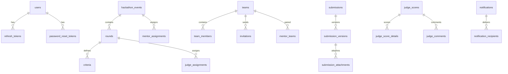

# Entity-Relationship Diagram

## Relationship Overview

## Tables (25)

### BaseEntity Columns (inherited by all except audit_logs)

| Column | Type | Notes |
|---|---|---|
| id | UUID | PK, auto-generated |
| created_at | TIMESTAMP | @CreatedDate |
| updated_at | TIMESTAMP | @LastModifiedDate |
| created_by | VARCHAR(255) | @CreatedBy |
| updated_by | VARCHAR(255) | @LastModifiedBy |

### Auth Module

**users** — `email` UQ, `status` (PENDING/ACTIVE/REJECTED/LOCKED), `user_type`, `failed_login_attempts`, `locked_until`

**refresh_tokens** — `token` UQ, `user_id` REF, `expires_at`, `revoked`

**password_reset_tokens** — `token` UQ, `user_id` REF, `expires_at`, `used`

### Event Module

**hackathon_events** — `name` UQ, `season`, `year`, `start_date`, `end_date`, `registration_deadline`, `status`

**rounds** — FK→events, `round_number` UQ(event+round), `start_date`, `end_date`, `submission_deadline`, `scoring_deadline`, `advancement_cutoff`

**criteria** — FK→rounds, `name`, `weight` [1-100], `sort_order`

**judge_assignments** — FK→rounds, `judge_user_id` REF, UQ(round+judge)

**mentor_assignments** — FK→events, `mentor_user_id` REF, UQ(event+mentor)

### Team Module

**teams** — `event_id` REF, `name` UQ(event+name), `leader_id` REF, `status`

**team_members** — FK→teams, `user_id` REF, `role` (LEADER/MEMBER), UQ(team+user)

**invitations** — FK→teams, `inviter_id` REF, `invitee_email`, `status`, `expires_at`

**mentor_teams** — `mentor_user_id` REF, FK→teams, UQ(mentor+team)

### Submission Module

**submissions** — `team_id` REF, `round_id` REF, `status`, `submitted_by` REF, UQ(team+round)

**submission_versions** — FK→submissions, `version_number`, `github_url`, `demo_url`, `submitted_at`

**submission_attachments** — FK→versions, `file_name`, `file_url`, `file_size` [1-5242880], `page_count` [1-2]

### Judging Module

**judge_scores** — `judge_user_id` REF, `submission_id` REF, `round_id` REF, `status`, `started_at`, UQ(judge+submission)

**judge_score_details** — FK→scores, `criteria_id` REF, `score` [0-100], UQ(score+criteria)

**judge_comments** — FK→scores, `criteria_id` REF, `comment`, UQ(score+criteria)

### Ranking Module

**rankings** — `team_id` REF, `round_id` REF, `final_score` NUMERIC(7,4), `rank`, `version`, UQ(team+round+version)

**advancements** — `team_id` REF, `round_id` REF, `status` (ADVANCED/ELIMINATED), UQ(team+round)

**published_results** — `round_id` REF UQ, `published_by` REF, `published_at`, `dispute_deadline`

**disputes** — `team_id` REF, `round_id` REF, `filed_by` REF, `reason`, `status`, `filed_at`

### Notification Module

**notifications** — `type`, `title`, `message`, `reference_id`, `reference_type`

**notification_recipients** — FK→notifications, `user_id` REF, `channel` (EMAIL/IN_APP), `read_at`, `sent_at`

### Audit Module

**audit_logs** — `actor_id`, `action`, `target_id`, `target_type`, `old_value` TEXT, `new_value` TEXT, `timestamp`, `ip_address` (NO BaseEntity — immutable, append-only)

## Constraints Summary

- **13 unique constraints** enforcing business rules at DB level
- **12 JPA foreign keys** (intra-module only)
- **22 cross-module UUID references** (no JPA FK — integrity at service layer)
