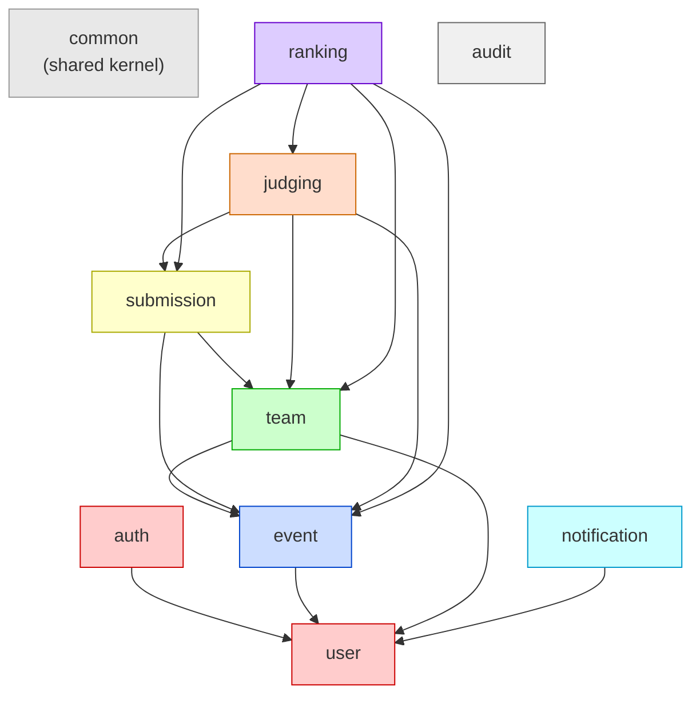
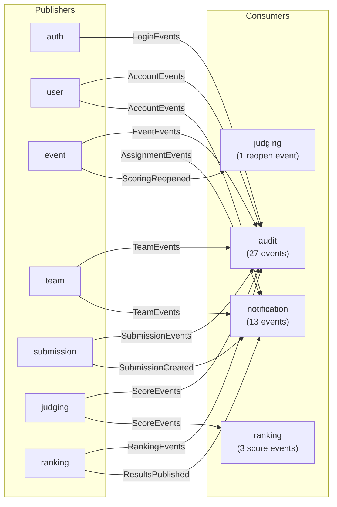

# Module Dependency Diagram

## Synchronous Dependencies (PublicService calls)



## Asynchronous Dependencies (Domain Events)



## Topological Build Order

```
Level 0:  common
Level 1:  user, infrastructure
Level 2:  auth, event
Level 3:  team, notification, audit
Level 4:  submission
Level 5:  judging
Level 6:  ranking
```

## Module Summary Table

| Module | Entities | Repositories | Services | Controllers | Events Published | Events Consumed | Endpoints |
|---|---|---|---|---|---|---|---|
| common | 1 (BaseEntity) | 0 | 0 | 0 | 0 | 0 | 0 |
| auth | 2 | 2 | 4 | 1 | 3 | 0 | 6 |
| user | 1 | 1 | 3 | 2 | 4 | 0 | 9 |
| event | 5 | 5 | 7 | 4 | 6 | 0 | 24 |
| team | 4 | 4 | 6 | 2 | 6 | 0 | 15 |
| submission | 3 | 3 | 3 | 1 | 2 | 0 | 6 |
| judging | 3 | 3 | 4 | 1 | 5 | 1 | 9 |
| ranking | 4 | 4 | 4 | 3 | 4 | 3 | 10 |
| notification | 2 | 2 | 2 | 1 | 0 | 13 | 5 |
| audit | 1 | 1 | 1 | 1 | 0 | 27 | 4 |
| **Total** | **26** | **25** | **34** | **16** | **30** | **44** | **88** |
